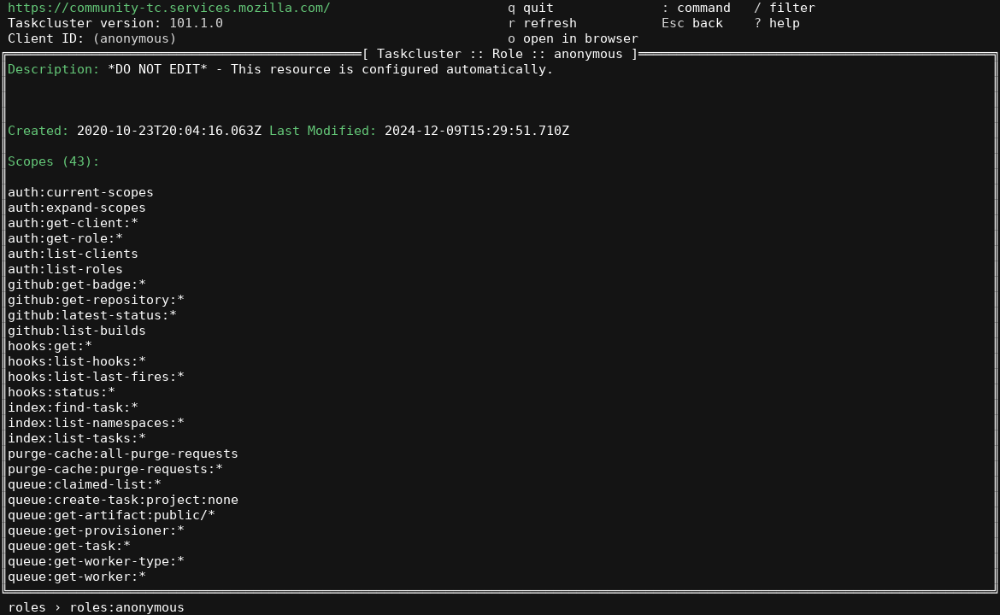
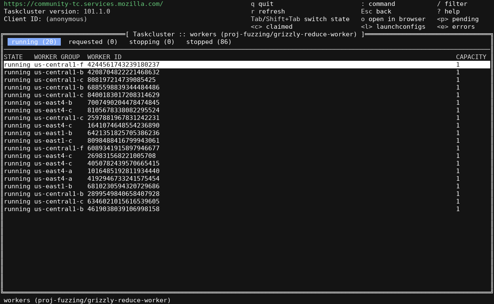
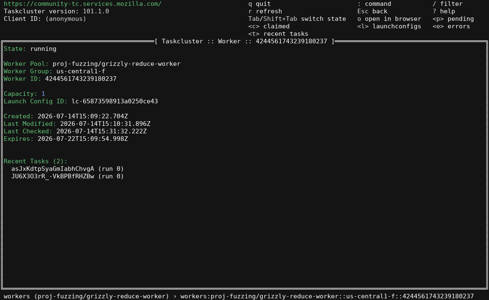
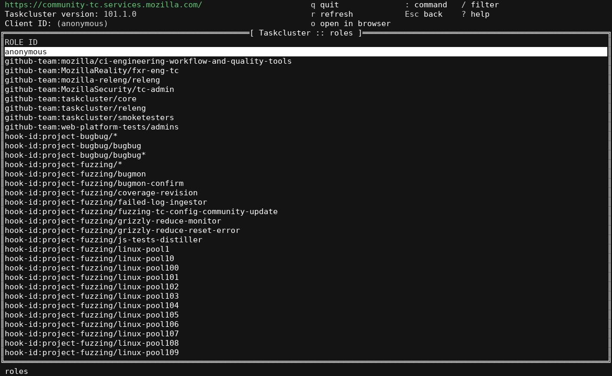
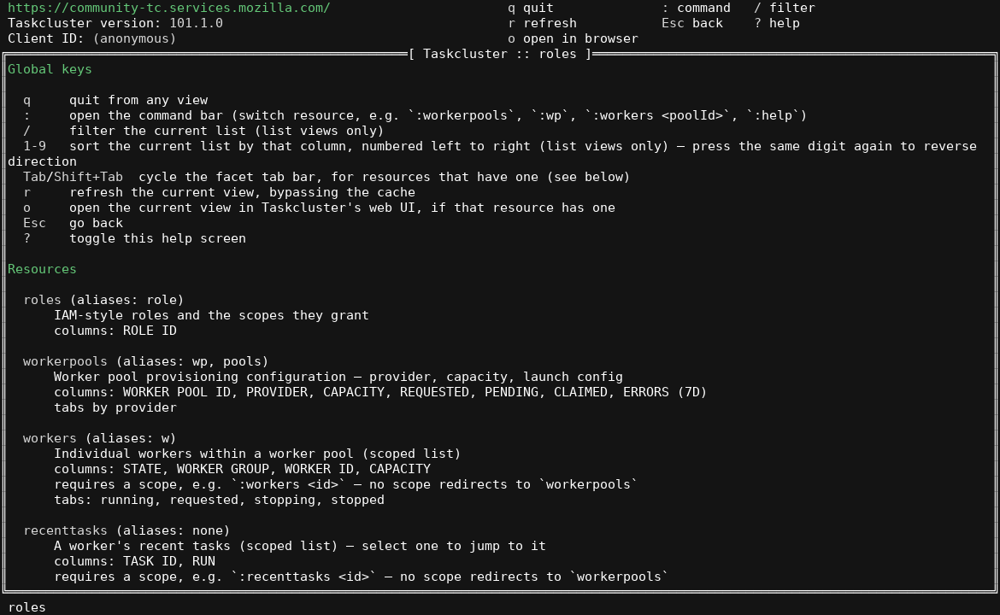

# tc-tui

A terminal UI for [Taskcluster](https://taskcluster.net), Mozilla's CI/task execution platform. Browse worker
pools, workers, roles, tasks, task groups, and more without leaving the terminal.


## Install / build

Requires Go 1.26+.

```sh
go build .                 # produces ./tc-tui
go run .
```

## Run

`tc-tui` needs `TASKCLUSTER_ROOT_URL` set — it panics on startup otherwise, since the Taskcluster client SDK is
initialized via `NewFromEnv()`:

```sh
export TASKCLUSTER_ROOT_URL=https://community-tc.services.mozilla.com/
go run .
```

Optional credential env vars (`TASKCLUSTER_CLIENT_ID`, `TASKCLUSTER_ACCESS_TOKEN`, etc.) enable authenticated
calls. Without them the app runs anonymously — most read-only resources on public instances (like
community-tc) are still browsable.

## Usage

Navigation is command-bar driven, similar to `vim`/`k9s`:

| Key | Action |
|---|---|
| `:` | open the command bar — switch resource, e.g. `:workerpools`, `:wp`, `:workers <poolId>` |
| `/` | filter the current list |
| `1`-`9` | sort the current list by that column (press again to reverse) |
| `Tab` / `Shift+Tab` | cycle the facet tab bar, for resources that have one |
| `j`/`k`, arrows | move selection / scroll |
| `Enter` | drill into the selected row |
| `r` | refresh the current view, bypassing the cache |
| `o` | open the current view in Taskcluster's web UI |
| `Esc` | go back |
| `?` | toggle the in-app help screen (full resource/key reference) |
| `q` | quit |

Resources are addressed by name or alias in the command bar (`:wp`, `:w`, `:g`, `:t`, ...) — press `?` inside
the app for the full, always-up-to-date list along with each resource's columns and required scope.

## Screenshots

| | |
|---|---|
|  |  |
|  |  |

<details>
<summary>Help screen (<code>?</code>)</summary>



</details>

Captured live against [community-tc](https://community-tc.services.mozilla.com/), Mozilla's public
community Taskcluster instance, running anonymously.

## Architecture

Four packages, in strict dependency order — `taskcluster` → `resource` → `shell` → `controller`:

- **`taskcluster/`** — thin wrapper around the generated Taskcluster Go clients (`github.com/taskcluster/taskcluster/v101`).
- **`resource/`** — one file per entity type (worker pools, workers, roles, tasks, task groups, ...), each
  implementing a common `Resource` interface (list/describe/columns/aliases/web URL).
- **`shell/`** — the `tview`/`tcell` UI: table view, detail view, command bar, filter, facets, sort, help,
  navigation stack, and persisted UI state.
- **`controller/`** — wires a `taskcluster.Taskcluster` client into a `resource.Registry` and starts the
  `shell.Shell`.

There are no tests for the UI rendering itself, but `resource/` and `shell/` are covered by unit tests
(`go test ./...`); there is no CI configured for this repo currently.

## Notes

- `.bak` files are leftover/reference files excluded from the build and ignored by git.
- The compiled `tc-tui` binary is git-ignored; don't commit it.
